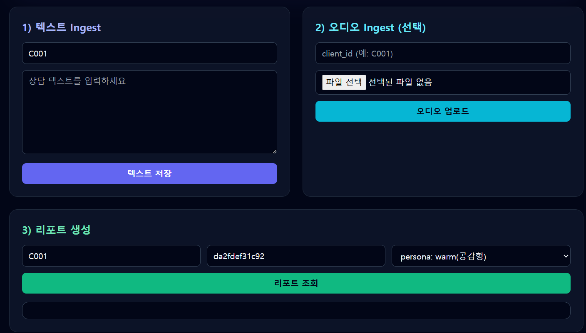
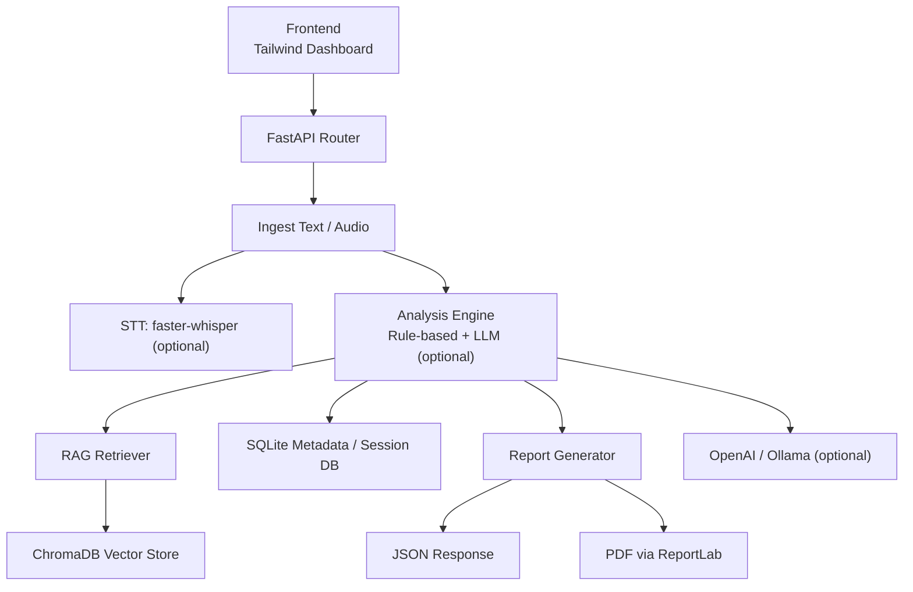
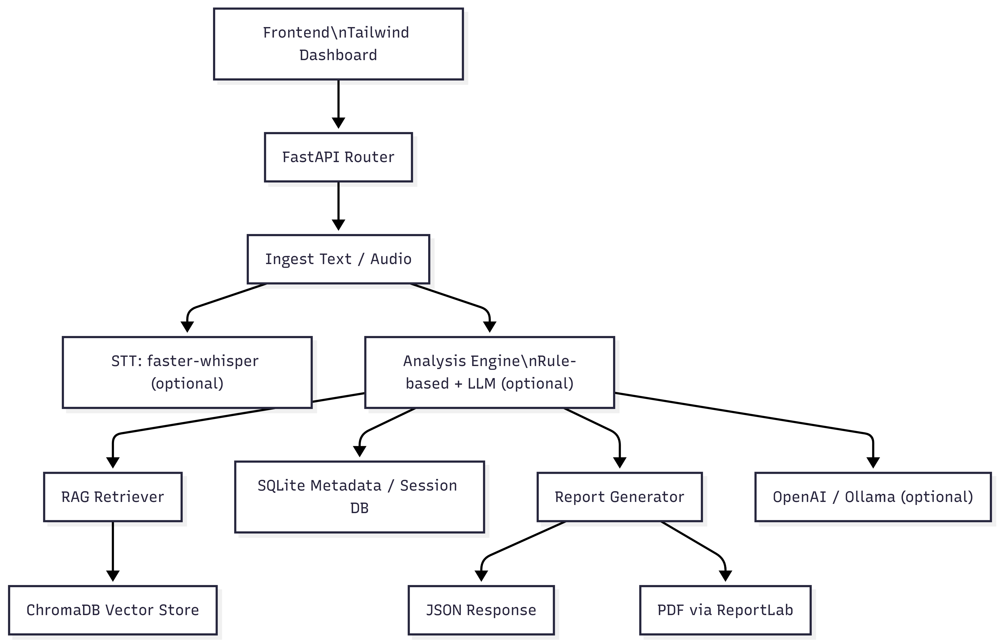

# 멀티모달 상담 분석 + RAG (FastAPI + Tailwind UI)

이 프로젝트는 상담 데이터를 수집/분석하고, 유사 사례를 검색(RAG)하여 최종 리포트를 생성하는 **엔드 투 엔드 파이프라인**입니다.
 
- 텍스트/오디오 ingest
- 심리 상태/갈등 요인/위험도 분석
- ChromaDB 기반 벡터 검색
- LLM(OpenAI/Ollama) 또는 룰 기반 fallback 리포트 생성
- PDF 리포트 다운로드
- Tailwind 기반 대시보드 UI



---

## 기술스택 도식 (Mermaid / 텍스트 기반)

아래 이미지는 이 저장소의 구성요소와 데이터 흐름을 도식화한 결과입니다.


- 위치: `docs/tech_stack.mmd`
- 특징: 바이너리 파일 없이 PR 리뷰/머지 가능한 텍스트 다이어그램



---

## 기술스택 상세

### Backend / API
- **FastAPI**: REST API 제공 (`/ingest/text`, `/ingest/audio`, `/report`, `/report/pdf`, `/seed`)
- **Uvicorn**: ASGI 서버 실행
- **Pydantic v2**: 요청/응답 스키마 검증
- **python-multipart**: 오디오 파일 업로드 처리

### AI / NLP
- **faster-whisper (옵션)**: 음성 파일 STT
- **sentence-transformers**: 임베딩 생성
- **RAG 파이프라인**: 유사 상담 문맥 검색 후 리포트 강화
- **OpenAI / Ollama (옵션)**: LLM 기반 리포트 생성

### 데이터 계층
- **SQLite**: 세션/메타데이터 저장 (`runtime/app.db`)
- **ChromaDB**: 벡터 인덱스 및 유사도 검색 (`runtime/chroma_store/`)

### 보고서/유틸리티
- **ReportLab**: PDF 생성
- **NumPy / Requests / Rich / Typer**: 수치 처리, HTTP, CLI/로그 보조

### Frontend
- **Tailwind CSS (CDN)** 기반 단일 페이지 대시보드
- 텍스트 ingest / 오디오 ingest / 리포트 조회를 한 화면에서 처리
- 다크 테마 + 카드형 레이아웃 + 반응형 구성

---

## 실행 방법

```bash
python3 -m venv .venv
source .venv/bin/activate   # Windows: .venv\Scripts\activate
pip install -r requirements.txt
cp .env.example .env
```

```bash
uvicorn api.main:app --host 0.0.0.0 --port 8000 --reload
```

- UI: http://localhost:8000/
- Swagger: http://localhost:8000/docs

---

```
curl -s http://localhost:11434/api/tags | head
```
---
```
docker run -d --name ollama \
  -p 11434:11434 \
  -v ollama:/root/.ollama \
  --restart unless-stopped \
  ollama/ollama:latest
```
---
```
ollama pull llama3.1
```
---
```
root@DESKTOP-D6A344Q:/home/AI-Faster-whisper_RAG_Vector# docker ps --format "table {{.Names}}\t{{.Image}}\t{{.Ports}}" | grep -i ollama
ollama        ollama/ollama:latest   0.0.0.0:11434->11434/tcp, [::]:11434->11434/tcp
```
---
```
docker exec -it ollama ollama pull llama3.1
```
---
```
root@DESKTOP-D6A344Q:/home/AI-Faster-whisper_RAG_Vector# curl -s http://localhost:11434/api/tags | head
{"models":[{"name":"llama3.1:latest","model":"llama3.1:latest","modified_at":"2026-02-17T13:16:24.945232012Z","size":4920753328,"digest":"46e0c10c039e019119339687c3c1757cc81b9da49709a3b3924863ba87ca666e","details":{"parent_model":"","format":"gguf","family":"llama","families":["llama"],"parameter_size":"8.0B","quantization_level":"Q4_K_M"}}]}root@DESKTOP-D6A344Q:/home/AI-Faster-whisper_RAG_Vector# 
```
---
```
root@DESKTOP-D6A344Q:/home/AI-Faster-whisper_RAG_Vector# curl -s http://localhost:11434/api/generate \
  -H "Content-Type: application/json" \
  -d '{"model":"llama3.1","prompt":"한국어로 한 문장만: Ollama 준비 완료"}' | head
{"model":"llama3.1","created_at":"2026-02-17T13:17:25.775956502Z","response":"O","done":false}
{"model":"llama3.1","created_at":"2026-02-17T13:17:25.996958301Z","response":"ll","done":false}
{"model":"llama3.1","created_at":"2026-02-17T13:17:26.231409922Z","response":"ama","done":false}
{"model":"llama3.1","created_at":"2026-02-17T13:17:26.486278971Z","response":"는","done":false}
{"model":"llama3.1","created_at":"2026-02-17T13:17:26.726166309Z","response":" ","done":false}
{"model":"llama3.1","created_at":"2026-02-17T13:17:26.992847562Z","response":"200","done":false}
{"model":"llama3.1","created_at":"2026-02-17T13:17:27.233127504Z","response":"9","done":false}
{"model":"llama3.1","created_at":"2026-02-17T13:17:27.476620406Z","response":"년","done":false}
{"model":"llama3.1","created_at":"2026-02-17T13:17:27.740653956Z","response":" ","done":false}
{"model":"llama3.1","created_at":"2026-02-17T13:17:27.969888368Z","response":"8","done":false}
```
## 빠른 API 테스트

### 1) 샘플 데이터 적재
```bash
curl -X POST http://localhost:8000/seed
```
---
```
/seed가 흔히 하는 일 (RAG 프로젝트에서)

당신 .env 구성( DB_PATH=runtime/app.db, CHROMA_DIR=runtime/chroma_store, RAG_TOP_K=4, OLLAMA_MODEL 등 )을 보면, /seed는 대체로 아래 중 하나(또는 조합)일 가능성이 큽니다.

SQLite 초기 데이터 삽입

runtime/app.db에 테이블 생성 + 기본 데이터 insert (예: 사용자/설정/샘플 질의 등)

RAG용 문서 인덱싱

특정 폴더의 문서(txt/pdf/md)를 읽어서 chunking → embedding 생성 → Chroma( runtime/chroma_store )에 저장

샘플 데이터/데모 시나리오 설치

“테스트 질문/답변”, “샘플 문서”, “데모 컬렉션” 등을 만들어서 바로 검색/질문 가능하게 함

(주의) 기존 데이터 리셋/재생성

어떤 구현은 seed 전에 기존 컬렉션/테이블을 지우고 다시 만들기도 합니다.
```

---
```
SESSION_ID=$(python3 - <<'PY'
import uuid
print(uuid.uuid4())
PY
)

curl -X POST "http://localhost:8000/ingest/text" \
  -H "Content-Type: application/json" \
  -d "{\"client_id\":\"C001\",\"session_id\":\"$SESSION_ID\",\"transcript\":\"회의에서 무시당한 느낌이 들어 화가 났고, 집에 와서도 불안해서 잠을 잘 못 잤어요.\"}"
```

### 2) 텍스트 ingest
```bash
curl -X POST "http://localhost:8000/ingest/text" \
  -H "Content-Type: application/json" \
  -d '{"client_id":"C001","transcript":"회의에서 무시당한 느낌이 들어 화가 났고, 집에 와서도 불안해서 잠을 잘 못 잤어요."}'
```

### 3) 리포트 생성
```bash
curl "http://localhost:8000/report?client_id=C001&session_id=<SESSION_ID>&persona=warm"
```

- `persona` 옵션: `default | warm | coach | strict` (미지정 시 `default`)

### 4) PDF 다운로드
```bash
curl -L "http://localhost:8000/report/pdf?client_id=C001&session_id=<SESSION_ID>" -o report.pdf
```

---

## 오디오 STT (옵션)

```bash
pip install faster-whisper
curl -X POST "http://localhost:8000/ingest/audio" \
  -F "client_id=C001" \
  -F "audio=@/path/to/audio.wav"
```

---

## LLM 연동 (옵션)

기본은 LLM 없이(rule-based fallback) 동작합니다.

### OpenAI
```bash
export LLM_PROVIDER=openai
export OPENAI_API_KEY=...
export OPENAI_MODEL=gpt-4o-mini
```

### Ollama
```bash
export LLM_PROVIDER=ollama
export OLLAMA_BASE_URL=http://localhost:11434
export OLLAMA_MODEL=llama3.1
```

---

## 런타임 저장소

- SQLite: `./runtime/app.db`
- Chroma: `./runtime/chroma_store/`
- 임시 업로드: `./runtime/tmp/`
- PDF 결과물: `./runtime/pdf/`

---

## 정신분석학 지식 기반 ChromaDB 구축 및 Docker 배포

### 1) 정신분석학 콘텐츠 크롤링 및 시드 데이터 업데이트

```bash
# Built-in corpus 전용 (네트워크 불필요)
python scripts/crawl_psychoanalysis.py --no-wikipedia

# Wikipedia 한국어 크롤링 포함 (네트워크 필요)
python scripts/crawl_psychoanalysis.py
```

출력 파일: `samples/psychoanalysis_seed.jsonl` (68개 이상 항목)

내용: 프로이트 이론, 방어기제, 융 분석심리학, 대상관계 이론, 애착이론, 자기심리학, 정신병리학적 개념 등 핵심 정신분석학 지식 (한국어)

### 2) ChromaDB 지식 베이스 빌드

```bash
python scripts/build_psycho_chroma.py \
    --chroma-dir runtime/chroma_store \
    --seed samples/psychoanalysis_seed.jsonl \
    --collection psychoanalysis_knowledge
```

빌드 후 `runtime/chroma_store/`에 `psychoanalysis_knowledge` 컬렉션이 생성됩니다.
리포트 생성 시 자동으로 관련 정신분석학 개념이 함께 검색됩니다 (`psych_hits` 필드).

### 3) Docker 이미지 빌드

```bash
docker build -f Dockerfile.chromadb -t edumgt/psycho-chroma-db:latest .
```

### 4) Docker Hub(edumgt)로 Push

```bash
# 수동 배포
docker login
bash scripts/push_dockerhub.sh latest

# 특정 버전 태그
bash scripts/push_dockerhub.sh v1.0.0

# CI 환경 (Personal Access Token 사용)
DOCKER_PAT=<token> bash scripts/push_dockerhub.sh latest
```

Docker Hub 이미지: `edumgt/psycho-chroma-db:latest`

### 5) Docker Compose로 전체 스택 실행

```bash
# .env 파일 설정 후
docker compose up -d

# 서비스 확인
docker compose ps
```

서비스 구성:
- `psycho-chroma` (port 8001): 정신분석학 ChromaDB HTTP 서버
- `api` (port 8000): 상담 RAG API

